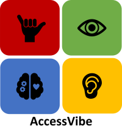

# AccessVibe 

  
  
# Introduction 🖋️
AccessVibe is a tech solution that enhances communication for individuals.
AccessVibe platform has been created with inclusivity in mind aiming to support individuals, with learning disabilities, limited motor skills and visual impairments.

## Our Features 📑

|  __Speech-to-text__  💬👉📝                                | __Text-to-speech__ 📝👉💬                                                       | __Sign language-to-text__ 👋👉📝                   |
|-------------------------------------------------------------|-----------------------------------------------------------------------------------|------------------------------------------------------|
| Use the mic to interpret user   message and display as text.| Convert written text into audible speech, using   Google's speech engine| Interpret BSL using the user's camera   and convert signs to text, which can be read out loud   to increase accessibility.

## Our Purpose 🏹
 _"As the family member of a hard of hearing person, I can understand my relatives better using sign language to text."_ ~ **Allen Humphry**

## Feature checklist
- [x] Speech to text code / text to speech code.
- [x] Sign language to text to speech code.
  - [x] Add code to localhost server. 
- [x] Update repository.
